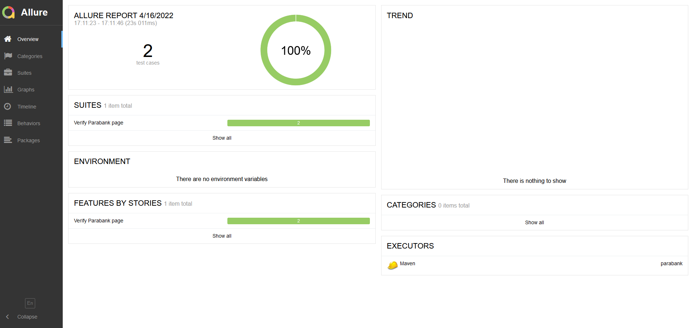

# Demo Selenide project with Cucumber and Gitlab CI/CD

Project is created for demo purposes and contains all required framework element to deploy and run working 
end-to-end tests. 

## Used tools
- [Selenide](https://selenide.org/)
- [Cucumber](https://cucumber.io/)
- [Allure](https://docs.qameta.io/allure/)
- [Gitlab CI/CD docs](https://docs.gitlab.com/ee/ci/)
- [Parabank - testing page](http://parabank.parasoft.com/parabank/services/bank)

## How to run on local machine:
###  By maven
- for all tests run: `mvn clean test`
- for single test use: `mvn clean "-Dtest=/path/to/test" test`

### By GitLab CI/CD
1. Log into dedicated [Gitlab repository](https://gitlab.com/kkol1/demo)
2. Open CI/CD -> Pipelines page
3. Run pipeline manually

## Create report from test
For reports, we will use _Allure_. After running tests all report partial files are saving in target directory.
To create report from test run  `mvn allure:report`. Then directory with static page will be created in _target/allure-report_. 

### Reports example:

## Gitlab CI/CD
For test running there is Gitlab CI/CD used with Selenium _standalone-chrome_ as a grid - image defined in **/Dockerfile**.